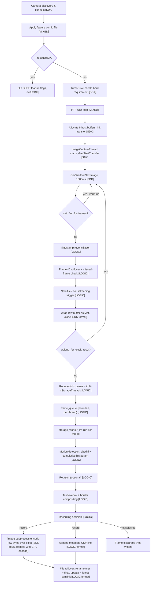
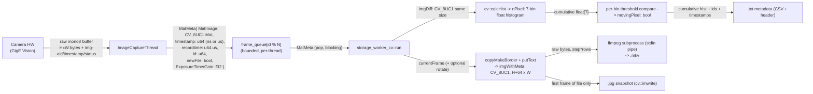

# VISSS Data Acquisition — SDK-Agnostic Processing Spec

## 1. Purpose & scope

This document describes **what the current C++ pipeline does to camera data**, independent of
the Teledyne DALSA GigE-V SDK it happens to be written against today. It exists so the pipeline
can be reimplemented against a different camera/SDK (Emergent Vision HR-2000SM + eSDK Pro +
GPUDirect/CUDA) without re-reading `data-acquisition/src/*.{cpp,h}`.

Source files this spec is extracted from:
- `data-acquisition/src/visss-data-acquisition.cpp` — camera connection, capture loop
- `data-acquisition/src/visss-data-acquisition.h` — shared state/constants
- `data-acquisition/src/storage_worker_cv.h` — per-frame processing, motion detection, encoding, metadata
- `data-acquisition/src/frame_queue.h` — inter-thread buffering
- `data-acquisition/src/visss-data-acquisition-dryrun.cpp` — file-based test harness (same downstream logic)

Every stage below is tagged:
- **[SDK]** — pure Teledyne/GigE-V plumbing (device discovery, feature I/O mechanics, buffer
  registration). Replace wholesale with the new SDK's equivalent; the *behavior* it produces
  (not the API calls) is what must be preserved.
- **[LOGIC]** — genuine processing logic. Must be ported faithfully (or a deliberate decision
  made to change it).
- **[MIXED]** — a processing decision expressed through SDK-specific calls; the *intent* must
  survive even though the mechanism won't.

## 2. Pipeline overview



## 3. Stage-by-stage specification

### 3.1 Camera discovery & connection **[SDK]**

`GevApiInitialize()` → `GevOpenCameraBySN(serial, GevExclusiveMode, &handle)` → fetch GenICam
XML (`Gev_RetrieveXMLFile`) → build a `GenApi::CNodeMapRef` from it → `GevConnectFeatures`.
(`visss-data-acquisition.cpp:1228-1280`)

Not processing logic — just "attach to this device and get a feature map." The new SDK will
have its own connect/enumerate call; the only externally-visible contract is: after this stage,
something downstream can get/set named device features by string name and pull frames.

### 3.2 Feature configuration from file **[MIXED — confirmed core feature, not disposable plumbing]**

The first positional CLI arg is a **plain-text config file** of whitespace-separated
`feature_name value` pairs (one per line), read with `fscanf(fp, "%s %s", ...)` and applied via
GenICam's generic `FromString()` on each named node (`visss-data-acquisition.cpp:1330-1370`).
This is how exposure time, gain, pixel format, packet size, MTU, ROI, trigger/PTP mode, and
digital I/O line outputs are actually set — **the values themselves don't live in this
codebase**; they live in the sibling `VISSS_configuration` repo (not in this checkout) as one
config file per camera/deployment.

**Confirmed with the project owner: applying a per-deployment config file to the camera at
startup is a core feature to keep, not disposable SDK glue** — only the `fscanf`/GenICam-node
*mechanics* are Teledyne-specific and get thrown away; the generic "load a flat feature=value
list, push each value to the device by name" capability must be reimplemented against the new
SDK, fed by an equivalent per-deployment config file.

Real example (`visss2_leader_visss2m2050_nya_leader_260211.yaml_2026-06-16.config`, a VISSS2
leader deployment for Ny-Ålesund, provided by the project owner — **the new camera will need its
own equivalent config with different feature names, this is illustrative of the mechanism and
category of settings, not a literal template**):
```
OffsetY 260
OffsetX 392
Width 1280
Height 1024
Gain 1
TestImageSelector Off
ExposureMode Timed
ExposureTime 120
TriggerMode Off
AcquisitionFrameRate 250
ptpMode Slave
LineSelector Line3
outputLineSource PulseOnStartofExposure
outputLinePulseDuration 60
outputLinePulseDelay 20
LineSelector Line4
outputLineSource PulseOnStartofExposure
outputLinePulseDuration 30
outputLinePulseDelay 0
```
This confirms the config covers: sensor ROI (`OffsetX/Y`, `Width`/`Height`), `Gain`, exposure
(`ExposureMode`/`ExposureTime`), `TriggerMode`, `AcquisitionFrameRate`, PTP mode
(`ptpMode Slave` — note this sets the camera's PTP role, separate from the `ptpStatus` *read*
in §3.5), and **two digital output lines pulsing on exposure start** (`LineSelector`
Line3/Line4, each with its own pulse duration/delay in — presumably — µs). Nothing in this
repo's C++ code reads or reacts to those line-output settings; they're a camera-side-only
effect of applying the config (see §9 for the open question of what they actually drive).

A camera serial (`camSerial`, 2nd positional CLI arg) selects which physical device to open.

### 3.3 `--resetDHCP` admin mode **[SDK]**

If set: flips `GevCurrentIPConfigurationDHCP=1` and `GevCurrentIPConfigurationPersistentIP=0` on
the camera, then exits (`visss-data-acquisition.cpp:1309-1327`). Not part of the capture
pipeline — a one-shot device-provisioning utility. Needs an equivalent "put the camera back into
DHCP addressing mode" operation for the new SDK/camera if that workflow is still needed for
initial 10GigE/RoCE NIC bring-up; otherwise can be dropped.

### 3.4 TurboDrive availability check **[SDK]**, hard requirement

`IsTurboDriveAvailable()` (`visss-data-acquisition.cpp:876-914`) queries a Teledyne-specific
lossless-compression transport feature. If unavailable, or available but not enabled
(`transferTurboMode != 1`), the program treats this as **fatal** (`global_error = true`,
process exits) (`visss-data-acquisition.cpp:1624-1649`).

This is a bandwidth-saving wire-format feature specific to Teledyne GigE-V, not a pixel-domain
processing step — there is nothing to "port" here algorithmically. **Confirmed with the project
owner: TurboDrive is Teledyne-specific and not relevant to the Emergent port** — drop this stage
entirely rather than looking for an equivalent.

### 3.5 PTP synchronization wait **[MIXED]**

Before starting capture (unless `--noptp=1`), poll the camera's own `ptpStatus` GenICam feature
string once per second until it equals exactly `"Slave"`, up to 30 attempts (~30s), else fatal
exit (`visss-data-acquisition.cpp:1655-1703`):

```cpp
while (std::string(ptp_status) != "Slave") {
  sleep(1s);
  status = GevGetFeatureValueAsString(handle, "ptpStatus", ..., ptp_status);
  if (status != GEVLIB_OK) { fatal }
  if (++ptpcounter > 30) { fatal }
}
```

Genuine requirement: **do not start capturing before the camera confirms its clock is
PTP-synced**, because downstream timestamp math (3.10) assumes a synced hardware clock. The
exact feature name/string value (`"ptpStatus"`/`"Slave"`) is Teledyne-specific vocabulary —
**confirmed with the project owner: eSDK Pro has its own PTP functions**, so this is a straight
swap to whatever "am I PTP-locked" query/callback the new SDK exposes, not a gap to solve from
scratch. This polling stage is separate from (and layered on top of) the host-level PTP daemons
(`ptp4l`/`phc2sys`, see `scripts/services/*`) that sync the NIC/system clock — the camera itself
also needs to independently report hardware-level lock, and the note in §3.2's example config
(`ptpMode Slave`) shows the camera's PTP *role* is itself a config-file-set feature, separate
from this runtime status *read*.

### 3.6 Buffer allocation & transfer initialization **[SDK]**

Allocates `NUM_BUF = 8` host-memory frame buffers sized to
`max(payload_size, pixel_bytes * width * (height + extra_lines_for_chunk_data))`, registers them
with `GevInitializeTransfer(handle, SynchronousNextEmpty, size, 8, bufAddress)`
(`visss-data-acquisition.cpp:1710-1751`). "Synchronous" buffer cycling means the SDK will not
overwrite a buffer that hasn't been explicitly released yet (see 3.14) — that back-pressure
contract needs an equivalent in the new SDK, especially once GPUDirect means "buffer" means "GPU
memory region," not a `malloc()`'d host pointer.

Also sets several Teledyne-specific transport tuning knobs (heartbeat timeout 5000ms, internal
frame-receive timeout 2001ms, 200-frame internal buffering, max packet-memory limit, 10µs
inter-packet pacing delay, stream-thread/server-thread CPU affinity) — pure SDK tuning, not
processing logic (`visss-data-acquisition.cpp:1573-1607`).

### 3.7 Capture thread priority & scheduling **[LOGIC — timing constraint, not SDK-specific]**

`ImageCaptureThread` runs at real-time `SCHED_RR` priority **80** (`visss-data-acquisition.cpp:322-335`),
same as the main thread (`visss-data-acquisition.cpp:1190-1203`). Storage worker threads run at
`SCHED_RR` priority **5** plus `nice(10)` (`storage_worker_cv.h:407-420,469-470`). This priority
gap is intentional: frame acquisition must always preempt encoding/storage work. Preserve this
relative priority relationship in the new implementation (exact numeric values are less
important than "capture thread must starve storage/encode threads if it needs to run").
Optional CPU-affinity pinning (`--cpuserver/--cpustream/--cpustorage/--cpuother/--cpuffmpeg`)
exists for the same reason — keeping the latency-critical capture path off CPUs shared with
bursty encode work.

### 3.8 Frame acquisition wait **[SDK]** + error/timeout handling **[LOGIC]**

`GevWaitForNextImage(handle, &img, 1000 /*ms*/)` blocks for the next frame
(`visss-data-acquisition.cpp:428-431`). Three outcomes:

1. **Success**, `img->status == 0` → proceed to processing (3.9+).
2. **Frame delivered with error status** (`img->status != 0`, e.g. incomplete/overflow/lost) →
   logged, buffer still released, frame silently dropped — no `MatMeta` produced, no counters
   incremented (`visss-data-acquisition.cpp:757-763`).
3. **Timeout** (`status == GEVLIB_ERROR_TIME_OUT`) or **other error/`img==NULL`** → increments a
   global `n_timeouts` counter and logs. Once `n_timeouts > max_n_timeouts1` the program treats
   this as fatal and exits (`visss-data-acquisition.cpp:765-801`).
   - `max_n_timeouts1 = 30` normally, `= 300` in `--followermode=1` (a follower/synced camera is
     expected to sit idle between trigger events, so it tolerates 10x more consecutive timeouts
     before giving up) (`visss-data-acquisition.h` default `max_n_timeouts=30`;
     `visss-data-acquisition.cpp:1032-1047`).
   - `n_timeouts` resets to 0 on the next successful frame (`visss-data-acquisition.cpp:725`).

Every buffer, successful or not, is returned to the SDK's ring buffer at the end of the loop
body via `GevReleaseImage()` (`visss-data-acquisition.cpp:815-821`) — the new SDK will have an
equivalent "I'm done with this buffer, reuse it" call; do this unconditionally, not just on the
success path.

Process-level resilience note: nothing in this program restarts itself — a fatal exit just ends
the process. `data-acquisition/launch_visss_data_acquisition.sh` is what loops forever and
restarts the binary 5s after any non-zero exit. Any reimplementation should assume the same
external supervisor exists (or explicitly decide to build restart logic in).

### 3.9 Startup warm-up skip **[LOGIC]**

The first `fps` frames received after the capture thread starts (`skipCounter > captureContext->fps`,
`visss-data-acquisition.cpp:426,438`) are received (and their buffer released) but **never** fed
into the processing pipeline. `skipCounter` only increments, never resets, so this only applies
once at thread startup, not after every clock-reset/new-file event. Purpose (inferred, not
stated in code): let camera exposure/auto-features settle for ~1 second before recording. Keep
this behavior; the exact "1 second's worth of frames" duration is tunable via `--fps` since the
skip count is literally the configured fps value.

### 3.10 Timestamp reconciliation **[LOGIC — this is the trickiest part to port correctly]**

There are **two mutually exclusive timestamp modes**, selected by `--noptp` (default 0 = PTP
mode):

| | PTP mode (`--noptp=0`, default) | No-PTP mode (`--noptp=1`) |
|---|---|---|
| Camera timestamp source | Hardware PTP clock, already absolute epoch time | Free-running counter, relative to last reset |
| Native unit | nanoseconds | microseconds |
| Conversion to `timestamp_s`/`timestamp_us` | `img->timestamp / 1e9` / `img->timestamp / 1e3` | `(img->timestamp + t_reset_uint_applied) / 1e6` / `(img->timestamp + t_reset_uint_applied)` |
| How absolute time is established | Camera hardware is PTP-locked (3.5); no host-side reset needed | Host periodically resets the counter and remembers wall-clock time of the reset |

No-PTP mode mechanics (`visss-data-acquisition.cpp:462-491,561-577`): on every housekeeping
trigger (3.13), the host calls `GevSetFeatureValueAsString(handle, "timestampControlReset", "1")`
and records `t_reset = system_clock::now()` → `t_reset_uint_ = t_reset epoch µs`. Because the
reset command and its actual effect on the camera counter are not synchronous, the code does
**not** trust `t_reset_uint_` immediately. Instead it watches the live timestamp stream for the
counter to actually jump backward by more than 1 second
(`(signed long)img->timestamp - last_cameratimestamp < -1e6`,
`visss-data-acquisition.cpp:563-577`) — only once that jump is observed does it commit
`t_reset_uint_applied = t_reset_uint_` and mark `reset_clock_detected = true`. **Until that
confirmation arrives, `waiting_for_clock_reset` is true and frames are dropped entirely** (not
queued — see 3.17), because their timestamp reference would otherwise be wrong.

`MatMeta.timestamp` (the value carried downstream to the storage stage) is set to
`img->timestamp + t_reset_uint_applied` in both modes (`t_reset_uint_applied` is simply 0 in PTP
mode) — so **its unit is nanoseconds in PTP mode and microseconds in no-PTP mode**, and the
storage stage re-derives `timestamp_s`/`timestamp_us` from it with the same mode-dependent
divisors (`storage_worker_cv.h:531-540`). Any port must decide up front which of these two
regimes the new camera+SDK actually needs — if the new hardware's PTP support is reliable, the
no-PTP fallback path (and its frame-dropping-during-reset edge case) may not need porting at
all; if it does, preserve the "wait for observed jump, not just the reset command" pattern, it
exists because the reset command's completion isn't otherwise observable.

`recordtime` (separate field, host receive time, not camera time) is
`high_resolution_clock::now()` taken immediately after `GevWaitForNextImage` returns, in µs since
epoch (`visss-data-acquisition.cpp:433,661`) — this is "when did the host see this frame," used
only as diagnostic metadata (drift tracking), never for file-splitting or motion-detection logic.

### 3.11 Frame-ID rollover handling **[LOGIC, device-specific constant]**

The camera's own per-frame ID counter wraps at **65535** (comment: "for m1280 camera," i.e. a
Teledyne-specific counter width — confirm the new camera's counter width, it may not be 16-bit).
Detected as a large negative jump and compensated with a running offset
(`visss-data-acquisition.cpp:550-559`):

```cpp
if ((((signed long)img->id + id_offset) - (signed long)last_id) < -1000) {
    id_offset += 65535;
}
```
`exportImgMeta.id = img->id + id_offset` is the monotonic ID used for everything downstream
(round-robin assignment, missed-frame detection, metadata).

### 3.12 Missed-frame diagnostic **[LOGIC, diagnostic only — does not affect data]**

```cpp
if (exportImgMeta.id != last_id + 1) {
    log("ERROR | missed frames between " + last_id + " and " + exportImgMeta.id);
}
```
(`visss-data-acquisition.cpp:666-672`). Purely a log line — no frame is dropped, retried, or
recovered because of this check. **Known false positive**: `last_id` is re-initialized to 0 at
every process (re)start, but the camera's own counter is not, so the very first frame after a
(re)start almost always logs a spurious "missed frames between 0 and N." Preserve the *logging*
behavior if useful for ops, but don't treat it as a correctness signal, and consider seeding
`last_id` from the first observed frame instead of 0 to eliminate the false positive when
porting.

### 3.13 New-file / housekeeping trigger **[LOGIC]**

```cpp
do_housekeeping = (new_file_interval > 0)
                && (timestamp_s % new_file_interval == 0)
                && ((timeNow - timeStart) > 10);
```
(`visss-data-acquisition.cpp:456-458`, default `new_file_interval = 300` seconds, i.e. file
boundaries land on 5-minute wall-clock marks; 0 disables rollover entirely). The `>10s` guard
debounces against the modulo condition re-triggering immediately (e.g. after a clock
correction). On trigger (or on the very first frame, `first_image`):
`framesInFile` resets to 0, camera status (temperature/PTP/transfer diagnostics) is refreshed
under `cameraStatusMutex` (3.16 in the header — see `visss-data-acquisition.cpp:495-545`), and
(no-PTP mode only) a new `timestampControlReset` is issued (3.10).

`framesInFile` resetting to 0 is what makes the storage stage open a new file (3.22) — the
first `nStorageThreads` frames after a reset each get `newFile = true`
(`visss-data-acquisition.cpp:684-693`) because sequential frame IDs are round-robined across
`nStorageThreads` independent output streams (3.15), so each stream needs its own "start a new
file" signal.

### 3.14 Zero-copy buffer wrap **[SDK format detail]**

```cpp
cv::Mat exportImg(img->h, img->w, CV_8UC1, m_latestBuffer);  // view, no copy
exportImgMeta.MatImage = exportImg.clone();                   // owned copy, buffer about to be released
```
(`visss-data-acquisition.cpp:624,659`). Pixel format is always **single-channel 8-bit
(`CV_8UC1`)** — there is no Bayer demosaic, no bit-depth conversion, no color-space handling
anywhere in this codebase. The sensor is assumed to already deliver 8-bit mono data. If the
Emergent HR-2000SM (mono variant, per its product naming) also delivers mono8, this stage is a
straight port; if it delivers a different bit depth/pixel format, this is where that
conversion needs to be added — it does not exist today.

The `.clone()` is mandatory: `img`'s buffer is returned to the SDK's reuse pool via
`GevReleaseImage()` at the end of the same loop iteration (3.8), so anything referencing the
original memory becomes invalid.

`imgSize = (img->w, img->h + frameborder)` (`visss-data-acquisition.cpp:625`) — `frameborder = 64`
pixels of vertical padding reserved for the text-overlay border added later (3.20); the capture
stage itself does not pad anything, it just accounts for the final frame size when constructing
the storage workers.

### 3.15 Round-robin distribution across storage threads **[LOGIC — subtle, easy to port wrong]**

```cpp
queue_index = exportImgMeta.id % nStorageThreads;
queue[queue_index].push(std::move(exportImgMeta));
```
(`visss-data-acquisition.cpp:698-707`). With `nStorageThreads > 1`, consecutive frames go to
*different* storage workers, each with its own independent `frame_queue` (3.16) and — critically
— **its own independent motion-detection state** (3.18). This means storage-thread *k*'s "previous
frame" (`imgOld`, used for frame-differencing) is not the immediately-preceding real-time frame,
but the frame received `nStorageThreads` iterations earlier. Motion detection is therefore
running on a temporally down-sampled sub-stream per thread, not on the full-rate stream.

**Confirmed with the project owner: this is intentional, not an oversight** — it's a workaround
for being CPU-bound (splitting frame-diff/histogram/encode work across N independent threads
was the only way to keep up with the camera's frame rate on CPU-only hardware). With
GPUDirect + GPU-resident processing removing the CPU bottleneck this workaround exists for,
**the expectation is this round-robin thread-splitting will not be needed at all** in the new
pipeline — motion detection should run on the full-rate, single sequential stream, with
parallelism (if still needed for encode throughput) applied without fragmenting the motion
baseline. Don't treat "N independent output streams" as a requirement to preserve; treat it as
an implementation detail of the old CPU-bound design.

Each `nStorageThreads` output is also encoded as a fully independent video file series/stream at
`fps / nStorageThreads` (`visss-data-acquisition.cpp:1010`, `storage_worker_cv.h` fps_ member) —
i.e. this is N parallel, independent, lower-frame-rate recordings, not N workers cooperatively
producing one stream.

### 3.16 Optional gain/exposure query **[LOGIC, metadata-only, no processing effect]**

If `--querygain=1`: reads `ExposureTime`/`Gain` GenICam features per frame and attaches them to
`MatMeta` (`visss-data-acquisition.cpp:674-682`). Used only for the text overlay (3.20) and
metadata/status log lines — never affects motion detection, encoding, or file decisions.

### 3.17 Frame drop during clock-reset window **[LOGIC edge case]**

```cpp
if (!waiting_for_clock_reset) {
    queue[queue_index].push(std::move(exportImgMeta));
}
```
(`visss-data-acquisition.cpp:704-707`). While waiting for a no-PTP clock reset to be confirmed
(3.10), frames are acquired from the camera and immediately discarded (never reach any queue,
never counted, never logged as dropped). This only happens in `--noptp=1` mode, right after each
housekeeping-triggered reset.

### 3.18 Motion detection — core algorithm **[LOGIC — the most important stage to preserve exactly]**

Runs per-frame inside `storage_worker_cv::run()` (`storage_worker_cv.h:521-597`), entirely on the
CPU today via `cv::absdiff`/`cv::calcHist`.

**Inputs**: current 8-bit mono frame (`CV_8UC1`), previous frame held in `imgOld` (same worker
thread's previous frame per 3.15 — zero-initialized, `image.MatImage * 0`, on that thread's very
first frame).

**Step 1 — absolute frame difference:**
```cpp
cv::absdiff(currentFrame, imgOld, imgDiff);   // CV_8UC1, same size as input
```

**Step 2 — non-uniform 7-bin histogram of the diff image**, bin edges from a hardcoded 8-element
table selected by `--minBrightChange` (only `20` or `30` are accepted, anything else is a fatal
CLI error, `visss-data-acquisition.cpp:1064-1093`):

| `--minBrightChange` | bin edges (8 values → 7 bins) |
|---|---|
| `20` (default) | `20, 30, 40, 60, 80, 100, 120, 256` |
| `30` | `30, 40, 60, 80, 100, 120, 140, 256` |

```cpp
cv::calcHist(&imgDiff, 1, /*channel*/0, cv::Mat(), nPixel,
             /*dims*/1, &histSize /*=7*/, &histRange /*=&range[0]*/,
             /*uniform=*/false, /*accumulate=*/false);
```
Bins are `[edge[i], edge[i+1])`; **diff values below the first edge (20 or 30) are not counted
in any bin** — i.e. a fixed noise floor is implicitly ignored.

**Step 3 — convert to cumulative-from-the-top histogram** (so `nPixelA[i]` = count of pixels
with `diff >= edge[i]`, not the per-bin count):
```cpp
for (int i = histSize - 2; i >= 0; --i) {   // histSize = 7
    nPixelA[i] += nPixelA[i + 1];
}
```

**Step 4 — per-bin adaptive threshold, exponentially looser for higher-intensity bins:**
```cpp
int minMovingPixel = 20;              // hardcoded constant, not CLI-tunable
int tt = 1;
for (bin = 0; bin < 7; ++bin) {
    int movingPixelThreshold = minMovingPixel / tt;   // INTEGER division, then widened to float
    if (movingPixelThreshold < 2) movingPixelThreshold = 2;   // floor of 2
    movingPixels[bin] = (nPixelA[bin] >= movingPixelThreshold);
    tt *= 2;   // thresholds: 20, 10, 5, 2, 2, 2, 2  for bins 0..6
}
movingPixel = OR of all movingPixels[bin];   // frame-level "something moved" flag
```
Note the threshold sequence for `minMovingPixel=20`: **20, 10, 5, 2, 2, 2, 2** (bins 3-6 all
floor out at 2 because `20/8=2`, `20/16=1→clamped`, `20/32=0→clamped`, `20/64=0→clamped`). This
means: a handful of very-high-contrast changed pixels (bin 6, diff ≥ 120 or 140) triggers motion
just as easily as a handful of pixels in bin 3 (diff ≥ 60/80) — the adaptive part of the
threshold only really differentiates bins 0-3.

`imgOld` is updated to the *current, pre-rotation* frame (`imgOld = currentFrame.clone()`)
**before** rotation (3.19) is applied — so rotation never affects the diff baseline.

`minMovingPixel = 20` and the two `range[]` tables are the exact, hardcoded values to preserve.
`--minBrightChange` is the only externally tunable knob into this stage (a binary choice between
the two tables above); `minMovingPixel` itself has no CLI flag despite looking like it should.

### 3.19 Image rotation **[LOGIC, optional, order-sensitive]**

If `--rotateimage=1`: `cv::rotate(currentFrame, currentFrame, ROTATE_90_COUNTERCLOCKWISE)`
(`storage_worker_cv.h:653-656`) — applied to the frame that gets displayed/encoded, **after**
it was used for motion detection (3.18), so rotation is purely cosmetic/output-orientation and
never feeds back into detection.

### 3.20 Text overlay & border compositing **[LOGIC/formatting]**

```cpp
cv::copyMakeBorder(frame, imgWithMeta, /*top=*/64 /*frameborder*/, 0, 0, 0,
                    cv::BORDER_CONSTANT, borderColor);
```
`borderColor = 0` (black) if `movingPixel || firstImage`, else `100` (gray) — a purely visual
"nothing happened in this frame" flag baked into the border color
(`storage_worker_cv.h:634-644,671-672`).

Overlay text drawn into that border strip (`putText`, `FONT_HERSHEY_PLAIN`, scale `1.8`, color
`255` (white), thickness `1`, `LINE_AA`, origin `(20,40)`,
`storage_worker_cv.h:658,674-680`), built as one concatenated string:

`[site + " | "] + formatted_timestamp + " | " + camera_name + " | Q:" + queue_depth + " | H: " + [highest triggered bin's edge value, 3-digit zero-padded, or empty] + [" | N.R." if nothing moved] + " | M: " + move_percent + "%" + " | " + thread_id + [" | E" + exposure + "G" + gain, if --querygain]`

`formatted_timestamp` = `YYYY/MM/DD HH:MM:SS.mmm` (**local time zone**, not UTC — see
`formatUnixTimeMicros`, `visss-data-acquisition.h`). `move_percent = frame_count_moving * 100.0 /
(frame_count_infile + 1)`, one decimal place.

This overlay/border work happens **unconditionally**, even if `--novideo` is set (only the
final `write()`/`imwrite()` calls are skipped in that case) — worth deciding whether to keep
computing it when video output is disabled in the new implementation, or skip it for efficiency.

### 3.21 Recording decision **[LOGIC — governs both video and metadata output]**

A frame's full processed image is written to video+metadata **only if**:
```cpp
writeallframes || movingPixel || firstImage || image.newFile || statusFrame
```
(`storage_worker_cv.h:686-703`), where:
```cpp
statusFrame = (timestamp_s % 10 == 0)
           && (framesSinceLastStatus > 1.5 * fps_)
           && (thread_id == 0);
```
— a periodic "heartbeat" frame roughly every 10 wall-clock seconds, **only from thread 0**,
gated so it can't fire more than once per ~1.5×fps-frame window. Purpose: guarantee some
recorded data even during long motionless periods, for tracking clock/capture-ID drift over
time. `writeallframes` (`--writeallframes`) is a debug override that disables all filtering.

Frames that don't meet this condition are fully processed (motion-detected, overlaid) but never
written anywhere — pure CPU/GPU work with no output.

### 3.22 File rollover & naming **[LOGIC/output format]**

On `firstImage || image.newFile`: close the previous file (see 3.24 for what "close" writes),
then open a new one. Naming scheme (`storage_worker_cv.h:313-372`), all timestamps derived from
`timestamp_us` (rounded to the nearest 0.1s: `(timestamp_us + 100000) / 1000000` truncated to
seconds) in **UTC**:

```
staging (written to while open): {output}/tmp/{hostname}_{name}_{DeviceID}_{YYYYMMDD-HHMMSS}_{threadId}.{mkv,txt}
final (renamed to on close):     {output}/{hostname}_{name}_{DeviceID}/data/{YYYY}/{MM}/{DD}/{hostname}_{name}_{DeviceID}_{YYYYMMDD-HHMMSS}_{threadId}.{mkv,txt}
latest symlink:                  {output}/{name}_latest_{threadId}.{mkv,jpg}  -> final path
```
A `.jpg` still-frame snapshot of the first frame of each new file is also written directly (not
through ffmpeg) via `cv::imwrite`, alongside its own `_latest` symlink
(`storage_worker_cv.h:679-685`). Symlinks are created via a `symlink()` + atomic `rename()` of a
`.tmp` link (`visss-data-acquisition.h create_symlink()`), not a direct symlink overwrite.

If a file is opened but zero frames ever met the recording condition (3.21) before the next
rollover, the empty `.mkv` is deleted instead of finalized (`storage_worker_cv.h:328-335`).

### 3.23 Video encoding **[SDK-plumbing-equivalent — this is the stage GPUDirect/NVENC replaces]**

Today, encoding is 100% delegated to an external `ffmpeg` process spawned via `popen()`
(`storage_worker_cv.h:210-244`):
```
[taskset -c <cpu>] ffmpeg -loglevel warning -y -f rawvideo -vcodec rawvideo \
  -framerate <fps/nStorageThreads> -pix_fmt gray -s <W>x<H> -i - \
  <user-supplied encoding opts, default "-c:v libx264"> \
  -r <fps/nStorageThreads> <output>.mkv
```
The bordered/overlaid/rotated frame's raw bytes (`imgWithMeta.data`, `step[0]*rows` bytes) are
`write()`n to that subprocess's stdin pipe (`storage_worker_cv.h:823-838`) — i.e. every frame
takes a full CPU→pipe copy, and compression itself is entirely off-CPU-thread but still
CPU-bound (libx264 by default). This is the stage to replace with GPU-resident encoding
(`cv::cudacodec::VideoWriter` or direct NVENC/Video Codec SDK) so frames never leave GPU memory
between motion-detection (3.18, would also need a GPU port) and the encoded bitstream. **No
processing logic lives in this stage** — the codec/container/bitrate choice is a deployment
config (`--encoding`), not something baked into the pipeline's meaning.

### 3.24 Metadata file writing **[LOGIC/output format — versioned, has a downstream consumer]**

One `.txt` file per video file, written incrementally as frames are recorded, header written
once on open (`storage_worker_cv.h::add_meta_data`, `storage_worker_cv.h:144-197`):

```
# VISSS file format version: 0.6
# VISSS git tag: <compile-time GIT_TAG>
# VISSS git branch: <compile-time GIT_BRANCH>
# Camera reset time: <YYYYMMDD-HHMMSS, UTC>
# us since epoche: <timestamp_us>
# Camera serial number: <DeviceIDMeta>
# Camera configuration: <basename of config file>
# Hostname: <hostname>
# Camera Temperature: <string, "nan" if never read>
# transferQueueCurrentBlockCount: <int, -99 if never read>
# transferMaxBlockSize MB: <float, -99 if never read>
# PTP Status: <string>
# Capture time, Record time, Frame id, Queue Length, 20, 30, 40, 60, 80, 100, 120  <- column names = bin upper edges (last edge 256 omitted as a column header)
```
One CSV line per **recorded** (3.21) frame (`storage_worker_cv.h:687-703`):
```
<timestamp_us>, <recordtime>, <frame_id>, <queue_depth_at_push_time>, <nPixelA[0]>, ..., <nPixelA[6]>
```
Note: the histogram values written are the **cumulative** (`>= edge[i]`) counts from 3.18 step
3, not raw per-bin counts. On close, a final `# Last capture time: <timestamp>` line is appended
(`storage_worker_cv.h:281`).

**This format is consumed downstream by `VISSSlib`** (not in this checkout) — any port that
changes column order, meaning, or the header format is a breaking change and should bump the
version string. See **§9** for a version-numbering discrepancy to resolve before porting.

### 3.25 Live preview window **[auxiliary, not core pipeline]**

Thread 0 only, if `--nopreview` not set: every `live_window_frame_ratio / nStorageThreads`-th
frame is downscaled 0.4x and shown via `cv::imshow` (`storage_worker_cv.h:756-764`,
`--liveratio` default 70). Purely operator-facing; has no effect on stored data. Division by
zero is possible if `nStorageThreads > live_window_frame_ratio` — guarded in current code but
worth just choosing sane defaults in the port.

### 3.26 Shutdown & cleanup **[SDK]**

On exit signal (SIGINT/SIGTERM) or fatal error: stop the capture loop, `GevStopTransfer`,
join the capture thread, cancel all `frame_queue`s (storage threads catch
`frame_queue::cancelled` and perform one final `close_files()` each,
`storage_worker_cv.h:894-901`), `GevAbortTransfer`/`GevFreeTransfer`, free host buffers,
`GevCloseCamera`, `GevApiUninitialize` (`visss-data-acquisition.cpp:1805-1836`). Straightforward
teardown; the only processing-relevant part is "flush and finalize the currently-open file for
each worker before exiting," which the port must also do.

## 4. Concurrency & timing model

- **1 capture thread** (`ImageCaptureThread`, `SCHED_RR` priority 80) — single producer, blocks
  on `GevWaitForNextImage` (1000ms timeout), does timestamp/ID bookkeeping + zero-copy buffer
  wrap, then a non-blocking bounded-queue push per frame (§3.7-3.17).
- **N storage worker threads** (`storage_worker_cv::run`, `SCHED_RR` priority 5, `nice(10)`,
  `N = --threads`, default 1) — each is an independent consumer of its own `frame_queue`, doing
  all of §3.18-3.24 synchronously per frame, one frame at a time, no internal parallelism.
- **Frame distribution is round-robin by ID modulo N** (§3.15), not load-balanced — a slow
  storage thread backs up only its own queue, not the others.
- **`frame_queue`** (`frame_queue.h`) is a bounded (`max_queue_size = 3000` frames, hardcoded),
  mutex+condvar-guarded queue, one instance per storage thread. On overflow it **drops the new
  frame and sets a global error flag** rather than blocking the producer
  (`frame_queue.h:68-90`) — backpressure is "give up," not "slow down the capture thread."
- **No frame-rate throttling** on the capture side — frames are processed as fast as the camera
  delivers and `GevWaitForNextImage` returns them; `--fps` only affects the *output* stream's
  declared frame rate passed to ffmpeg and the startup warm-up count (§3.9), it does not gate
  acquisition.
- **Real-time constraint**: capture thread must never block for long (no disk I/O, no encoding)
  — that's the entire reason the producer/consumer split with a dedicated bounded queue exists.
  Any GPU port must preserve this: GPU memory allocation/kernel launches on the capture thread
  should be non-blocking/async, with the actual GPU processing work happening on the
  worker-thread side of the queue, same as today's CPU split.
- Cross-thread shared state (`cameraTemperature`, `ptp_status`, `transferQueueCurrentBlockCount`,
  `transferMaxBlockSize`) written by the capture thread, read by every storage worker when
  writing metadata headers, is guarded by `cameraStatusMutex` — the equivalent status data in a
  GPU pipeline will need the same treatment.

## 5. Config/parameters reference

CLI flags are parsed once at startup (`cv::CommandLineParser`, full list at
`visss-data-acquisition.cpp:78-115`); nothing is re-read at runtime.

| Flag | Default | Affects |
|---|---|---|
| `-o/--output` | `./` | output root path |
| `-s/--site` | `none` | text overlay prefix, metadata |
| `-e/--encoding` | `-c:v libx264` | ffmpeg args (§3.23) |
| `-l/--liveratio` | `70` | preview frame decimation (§3.25) |
| `-f/--fps` | `140` | warm-up skip count (§3.9), divided by `nStorageThreads` for output stream fps |
| `-i/--newfileinterval` | `300`s | file rollover period (§3.13), `0`=disable |
| `-m/--maxframes` | `-1` (unlimited) | debug: stop after N frames |
| `-w/--writeallframes` | `0` | disables recording-decision filtering (§3.21) |
| `-r/--rotateimage` | `0` | §3.19 |
| `-d/--followermode` | `0` | timeout tolerance ×10 (§3.8) |
| `--nopreview` | shown | §3.25 |
| `-p/--noptp` | `0` (PTP on) | §3.10 timestamp mode |
| `-b/--minBrightChange` | `20` | must be `20` or `30`; selects histogram bin-edge table (§3.18) |
| `-q/--querygain` | `0` | §3.16 |
| `--novideo` | video stored | §3.21/3.23 |
| `--nometadata` | metadata stored | §3.24 |
| `--resetDHCP` | off | §3.3, exits after running |
| `-n/--name` | `VISSS` | file naming (§3.22), overlay text |
| `-t/--threads` | `1` | `nStorageThreads`, §3.15 |
| `--cpuserver/--cpustream/--cpustorage/--cpuother/--cpuffmpeg` | `-1` (unset) | thread/process CPU affinity, §3.7 |
| positional 1 | — | GenICam feature-config file path (§3.2) |
| positional 2 | — | camera serial (§3.1) |

**Hardcoded, not CLI-tunable despite looking like they should be** — preserve these exact values
unless deliberately changing them:

| Constant | Value | Where | Meaning |
|---|---|---|---|
| `minMovingPixel` | `20` | `visss-data-acquisition.h:232` | motion threshold base (§3.18) |
| `frameborder` | `64` px | `visss-data-acquisition.h:142` | overlay border height (§3.20) |
| `max_queue_size` | `3000` frames | `frame_queue.h:5` | per-thread queue cap |
| `max_n_timeouts` | `30` | `visss-data-acquisition.h:106` | ×10 in follower mode (§3.8) |
| `NUM_BUF` | `8` | `visss-data-acquisition.cpp:43` | host capture buffers |
| frame-ID wrap | `65535` | `visss-data-acquisition.cpp:550-554` | 16-bit counter, device-specific (§3.11) |
| PTP wait | `30` retries × `1`s | `visss-data-acquisition.cpp:1669-1701` | §3.5 |
| clock-reset jump threshold | `-1e6` (µs, i.e. >1s) | `visss-data-acquisition.cpp:563-565` | §3.10 |
| housekeeping debounce | `10`s | `visss-data-acquisition.cpp:458` | §3.13 |
| status-frame interval | `10`s, gated by `1.5×fps` | `storage_worker_cv.h:670-671` | §3.21 |
| `GevWaitForNextImage` timeout | `1000`ms | `visss-data-acquisition.cpp:431` | §3.8 |
| capture-thread warm-up | first `fps` frames | `visss-data-acquisition.cpp:426,438` | §3.9 |

**Confirmed with the project owner: `minMovingPixel` and `frameborder` are fine to keep
hardcoded** in the new implementation — no need to promote them to CLI parameters.

## 6. Data flow with types



## 7. External (non-SDK) dependencies

| Library | Used for | New-SDK relevance |
|---|---|---|
| OpenCV core/imgproc | `Mat`, `absdiff`, `calcHist`, `copyMakeBorder`, `putText`, `rotate`, `resize` | Needs a CUDA build (`cv::cuda`) for a GPU port — stock apt `opencv4` here has no CUDA; **`cv::cuda` has no `putText`/text-rendering equivalent**, budget time for that (§ Needs clarification) |
| OpenCV highgui | `namedWindow`/`imshow`/`waitKey` (preview, §3.25) | cosmetic only, low port risk |
| OpenCV videoio | `VideoCapture` (dryrun input only), `VideoWriter::fourcc` (codec constant only, `cv::VideoWriter` itself is unused — actual encoding goes through the ffmpeg subprocess, §3.23) | not core to live pipeline |
| Boost (`algorithm/string`) | `trim`/`split` (config parsing, dryrun CSV parsing) | trivial to replace, not camera-specific |
| `ffmpeg` (external process, not linked) | video encoding (§3.23) | replace with GPU encode path or keep as an NVENC-invoking `ffmpeg` call — either is a valid port choice |
| libpcap, POSIX pthread/`sched.h` | linked (`Makefile`) for real-time scheduling/affinity; no direct pcap API calls found in this repo's source — likely a transitive requirement of the DALSA SDK itself | verify whether the new SDK needs it; probably drop |

## 8. Dry-run harness (reference for building an equivalent test path)

`visss-data-acquisition-dryrun.cpp` reads a previously-recorded `.mkv` + companion `.txt` file
(same format as §3.24's own output — columns 0 and 2, i.e. `timestamp_us` and `frame_id`, are
read back per frame) instead of a live camera, and feeds frames into the **same**
`frame_queue`/`storage_worker_cv` code as the live pipeline (`visss-data-acquisition-dryrun.cpp:12-17,148-260`).
Because the input video already has the §3.20 border baked in, it's cropped back off first
(`cv::Rect(0, frameborder, w, h - frameborder)`, `visss-data-acquisition-dryrun.cpp:245-248`)
before re-entering the pipeline. This is the only thing resembling a test harness in the repo
today — worth building an equivalent for the new SDK (feed pre-recorded GPU-memory-resident
frames through the new processing path without needing a physical camera attached).

## 9. Needs clarification

### Resolved (confirmed by project owner, 2026-08-07)

1. ~~Metadata format version mismatch~~ — not actually a mismatch: the README's version-history
   headings (0.1-0.4) and the "VISSS file format version" written into metadata files (0.3-0.6)
   are two intentionally separate counters. README updated to cross-reference them (§0.3.2 →
   file format 0.5, §0.4 → file format 0.6). Current/target file format version for the port is
   confirmed **0.6**.
2. ~~Per-thread motion-detection baseline under `--threads > 1`~~ (§3.15) — confirmed
   intentional: a workaround for being CPU-bound on the old hardware, not an oversight. With
   GPUDirect removing that bottleneck, **this round-robin thread-splitting is expected to be
   unnecessary in the new pipeline** — motion detection should run on the full-rate sequential
   stream instead. See §3.15 for the updated framing.
3. ~~`minMovingPixel`/`frameborder` hardcoded~~ — confirmed fine to keep hardcoded, no need to
   expose as CLI parameters.
4. ~~TurboDrive hard-fail policy~~ (§3.4) — confirmed Teledyne-specific, not relevant to the
   Emergent port. Drop entirely, no equivalent needed.
5. ~~Commented-out "dump applied camera config to file" feature~~
   (`visss-data-acquisition.cpp:1471-1541`) — confirmed debug-only and not needed; do not port.
6. ~~PTP status string values~~ (§3.5) — confirmed Teledyne-specific vocabulary (`ptp4l`'s BMCA
   state names via `ptpStatus`/`"Slave"`). eSDK Pro has its own PTP functions/status query — look
   those up when implementing this stage rather than trying to match the string `"Slave"`.
7. ~~Camera feature-config file contents~~ (§3.2) — a real example was provided (VISSS2 leader
   deployment) and incorporated into §3.2. **The new Emergent camera will need its own config
   with different feature names** — the example only establishes the mechanism/category of
   settings (ROI, gain, exposure, trigger mode, frame rate, PTP role, digital I/O line pulses),
   not literal values to reuse. Applying such a config to the camera at startup is confirmed to
   be a **core feature**, not disposable plumbing (updated framing in §3.2).

### Still open

8. **`cv::cuda` has no direct `putText` equivalent.** §3.20's overlay is core to the file/status
   conventions operators rely on (queue depth, motion marker, drift-tracking timestamp). A GPU
   port needs an explicit decision here: NPP text rendering, a custom kernel, or downloading just
   the border strip to CPU for text compositing before re-uploading. Not something the old code
   answers, since it never had this problem.
9. **`libpcap` linkage** (`Makefile`) has no corresponding API call found anywhere in this
   repo's `.cpp`/`.h` files — likely pulled in transitively by the DALSA SDK's own internals.
   Confirm whether the new SDK needs it before assuming it can be dropped.
10. **Purpose of the digital I/O line-pulse config** (newly discovered via the example config in
    §3.2: `LineSelector Line3`/`Line4`, `outputLineSource PulseOnStartofExposure`,
    `outputLinePulseDuration`/`outputLinePulseDelay`). Nothing in this repo's C++ code reads or
    reacts to these — they're a pure camera-side effect of the config file. Unclear what they
    physically drive (external strobe/illumination trigger? synchronization pulse for another
    instrument, e.g. the `sonic/` sensor? something else?). Worth confirming before the port,
    since if it's operationally required, the new camera/SDK needs an equivalent digital-output
    trigger mechanism — this spec can't tell from the code alone.

### Build system note (not a pipeline question, but relevant to porting logistics)

The current `data-acquisition/makefile` (GNU Make, hand-written GigE-V-specific include paths)
should be **ignored** as a template for the new SDK integration — per the project owner, the new
SDK's example code uses **CMake**, and the port should follow that convention rather than
extending the old Makefile.
